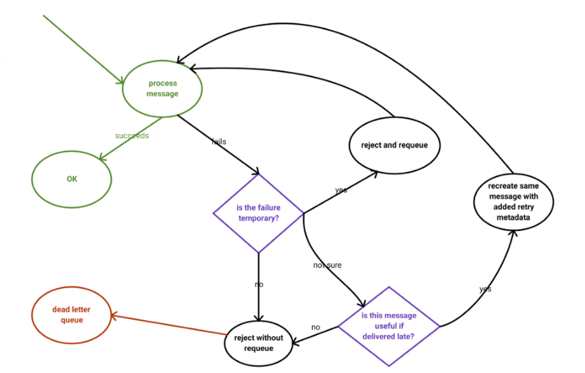

## Enters TTL + Dead-Lettering

## Motivation

Although, it’s possible to publish messages with a TTL (time-to-live). This pretty much means that the message will stay in the queue until that specific time expires:

message won't stay in the queue longer than 1 second

```sh
queue.publish("some message", expiration: 1000)
```
No surprises here. The message above will stay in the queue until 1 second passes. After that, the message will be either discarded or dead-lettered.

## Dead-Lettering
Routing Dead-Lettered Messages

Dead-lettered messages are routed to their dead letter exchange either:

- with the routing key specified for the queue they were on; or, if this was not set,
- with the same routing keys they were originally published with
- 

Messages from a queue can be ‘dead-lettered’; that is, republished to another exchange when any of the following events occur:

- The message is rejected (basic.reject or basic.nack) with requeue=false,
- The TTL for the message expires; or
- The queue length limit is exceeded.

PS: You can set requeue is true to activate routing key on dead letter queue. After retry count, false is drawn and permanence is achieved and not requeued again. If we added ttl on the Retry queue, it would go into an infinite loop event set requeue is false.Because the message will dispose end of tll. Therefore, by creating a queue named delay, the retry machine is provided to work like a job.


## How to setup rabbitmq cluster

```sh
vagrant up
```


sample queue topology 

``` dotnet
public IDispatchedEventBus CreateQueueTopology(string queueName)
{
    string retryQueue = $"{queueName}.retry";
    string delayQueue = $"{queueName}.delay";
    string retryExhange = $"{_options.TopicExchangeName}.retry";

    using (var model = _subConnection.CreateModel())
    {
        model.ExchangeDeclare(_options.TopicExchangeName, _options.ExchangeType, true, false, null);
        model.ExchangeDeclare(retryExhange, _options.ExchangeType, true);

        model.QueueDeclare(queueName, true, false, false, new Dictionary<string, object>()
        {
            {"x-dead-letter-exchange", retryExhange},
            {"x-dead-letter-routing-key", retryQueue},
        });

        model.QueueDeclare(retryQueue, true, false, false, new Dictionary<string, object>()
        {
            {"x-dead-letter-exchange", _options.TopicExchangeName},
            {"x-dead-letter-routing-key", queueName},
        });

        model.QueueBind(queueName, _options.TopicExchangeName, queueName);
        model.QueueBind(retryQueue, retryExhange, retryQueue);

        if (_options.UseScheduler)
        {
            model.QueueDeclare(delayQueue, true, false, false,
                new Dictionary<string, object>()
                {
                    {"x-dead-letter-exchange", _options.TopicExchangeName},
                    {"x-dead-letter-routing-key", queueName},
                    {"x-message-ttl", _options.Ttl}
                });

            model.QueueBind(delayQueue, _options.TopicExchangeName, delayQueue);
        }
    }

    return this;
}
```

## Failure topology
 

----------------------------

If you make requeue for message on dlx with diffirent routing key
then rabbitmq will create x-dead header automatically like ;

``` sh
{
  "x-death": [
    {
        count:	10
        exchange:	Exchange
        queue:	checkout-order-created.development.delay
        reason:	expired
        routing-keys:	checkout-order-created.development.delay
        time:	1587148474
    }
  ]
}

```

# References 

- https://github.com/rabbitmq/rabbitmq-delayed-message-exchange
- https://www.reactivemanifesto.org/
- https://www.reactivemanifesto.org/glossary#Back-Pressure
- https://www.rabbitmq.com/partitions.html
- https://www.cloudamqp.com/blog/2017-03-14-how-to-persist-messages-during-RabbitMQ-broker-restart.html
- https://martinfowler.com/bliki/BoundedContext.html
- https://felipeelias.github.io/rabbitmq/2016/02/22/rabbitmq-exponential-backoff.html
- https://www.cloudamqp.com/docs/delayed-messages.html
- https://github.com/rabbitmq/rabbitmq-delayed-message-exchange
- https://medium.com/codait/handling-failure-successfully-in-rabbitmq-22ffa982b60f
